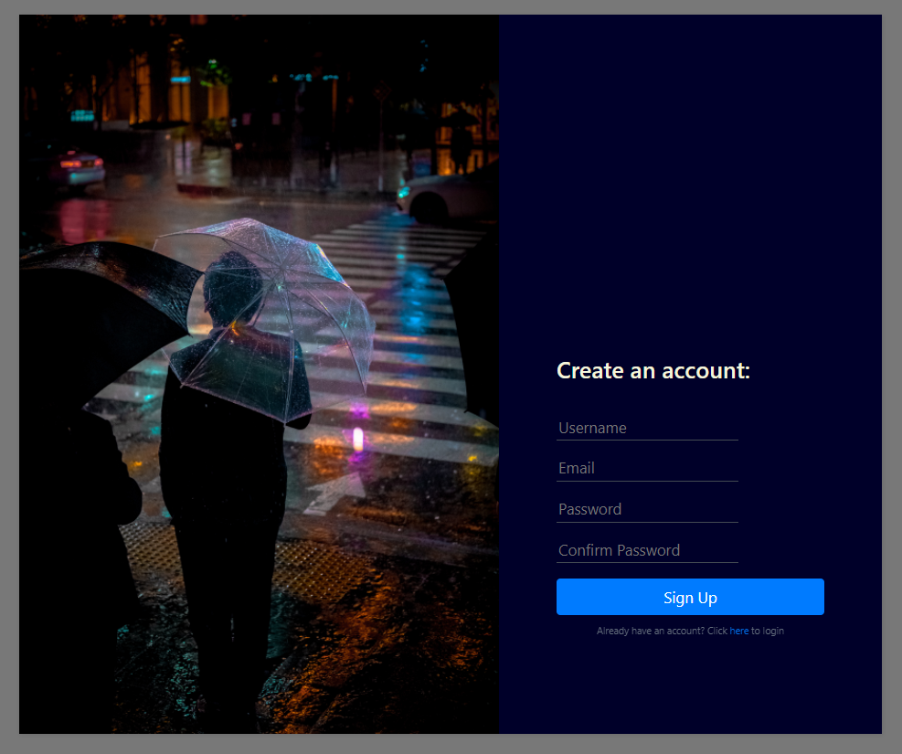

# Overread

Overread is personal blog website. Overread discusses a variety of topics, from sports to video games to the weather. In order to read the blogs, a user must create an account. Once an account has been created, a user can read and comment on blogs.
They can go back later and edit or delete their comments if they wish. The admin of the site is the only one who has the ability to create, update, or delete blog posts. The admin also has the ability to delete user comments if they wish.

## Screenshots

## User Stories

As a site admin:
- I want to be able to post blogs
- I want to be able to edit blogs
- I want to be able to delete blogs
- I want to be able to delete comments

As a site user:
- I want to be able to create an account with my information
- I want to be able to read blogs
- I want to be able to comment on blogs
- I want to be able to edit my comments
- I want to be able to delete my comments
- I want to be able to search for blogs
- I want to be able to like comments

## Technologies
- Spring MVC
- Maven
- Hibernate
- MySQL Connector
- Spring ORM
- Spring Security
- Tomcat
- Java Server Pages
- Junit
- Mockito

## Database Schema

create database overread;

create table authorities
(
    authorityId int auto_increment
        primary key,
    AUTHORITY   varchar(255) null
);

create table blogs
(
    id           bigint auto_increment
        primary key,
    AUTHOR       varchar(255) not null,
    BLOGCONTENTS longblob     not null,
    CONTENTS     varchar(255) null,
    DATECREATED  datetime     not null,
    TITLE        varchar(255) not null
);

create table comment
(
    id              bigint auto_increment
        primary key,
    AUTHOR          varchar(255) not null,
    COMMENTCONTENTS tinyblob     not null,
    CONTENTS        varchar(255) null,
    blog_id         bigint       null,
    constraint FKr2i27rhmf7u6pb3vgksgjp98c
        foreign key (blog_id) references blogs (id)
            on delete cascade
);

create table users
(
    USERNAME varchar(255) not null
        primary key,
    EMAIL    varchar(255) not null,
    ENABLED  bit          null,
    PASSWORD varchar(255) not null
);

create table user_roles
(
    username    varchar(255) not null,
    authorityId int          not null,
    primary key (username, authorityId),
    constraint FKi8la7mj8xkryi96gxc1hc5nhh
        foreign key (username) references users (USERNAME),
    constraint FKoq0ourkl718qj9kckwejabg8
        foreign key (authorityId) references authorities (authorityId)
);

## Technical Challenges

- Using spring security to correctly sign in users and assign them a default role
	- Lots of Google, followed the examples, and researched using spring security tags

- Handling cascading deleting with blogs and comments
	- Made sure to correctly label owning entity and cascade type

## Future Features

- Add OAuth2 support
- Turn comments into threads (users can comment on a blog, then comment on that comment, and so on)
- Update formatting of blogs to allow for customization

## Support

For any questions, concerns, or suggestions, feel free to contact me at: samueldmaus@gmail.com